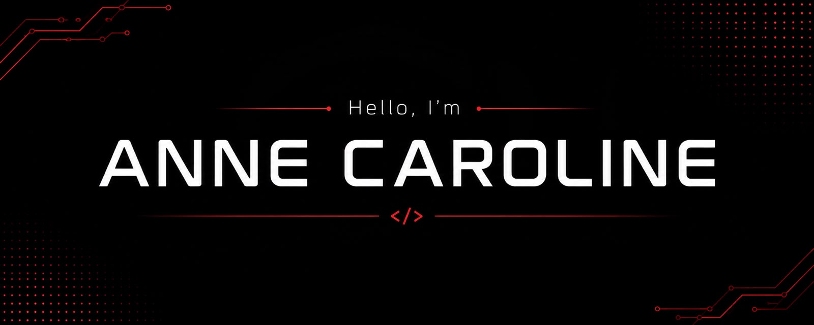

  

### Software Engineering Student

🎓 Software Engineering student from Brazil.

💻 Currently learning **C and Python**, with a focus on programming logic, problem solving and algorithms.

🌱 Learning by building projects, practicing and exploring new technologies.

---

## 🛠️ Technologies & Tools

  

---

### 📌 Linguagens e Técnicas de Programação

Exercises and projects developed during my studies in **C programming**, covering programming fundamentals, logic and problem solving.

---

## 📫 Connect with me

📧 **mogvdev@gmail.com**

💼 **LinkedIn:** [Connect with me](https://bit.ly/3RPaKW4)
